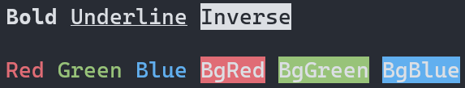

# 🖍 Kokuban
Kokuban simplifies styling strings in the terminal for .NET applications. (Kokuban is "blackboard" in Japanese.)



Kokuban is based on JavaScript library [Chalk](https://github.com/chalk/chalk) for many of its concepts and some of its code.

## Features
- Expressive API
- Auto detects color support
- Auto enables escape sequence support on Windows 10 20H1 or later
- 256 (8-bit) / TrueColor (24-bit) colors support

## Requirements

- .NET Standard 2.0 or higher

## Install
```
dotnet package add Kokuban
```

## Usage

```csharp
using Kokuban;

// Use `+` operator.
Console.WriteLine(Chalk.Red + "Hello");
Console.WriteLine(Chalk.Red + ("Hello " + (Chalk.Underline.BgBlue + "World")) + "!");

// Use indexer.
Console.WriteLine(Chalk.Red.Underline["Hello"]);
Console.WriteLine(Chalk.Red.Underline["Hello " + Chalk.Underline.BgBlue["World"]]);

// Use `ToStyledString` extension method.
Console.WriteLine("Foo Bar Baz".ToStyledString(Chalk.White.Blue));

// Use `Render` method.
Console.WriteLine(Chalk.Rgb(255, 128, 128).Render("Hello Konnichiwa!"));
```
### Nested styles
If you nest styled strings, the styles will be automatically stacked.

```csharp
Console.WriteLine(
    Chalk.Bold.Gray.BgYellow[
        "＼" + 
        Chalk.White.BgRed["Hello"] +
        " " +
        Chalk.White.BgBlue["コンニチハ"] +
        "!!／"
    ]
);
// or
Console.WriteLine(
    Chalk.Bold.Gray.BgYellow + (
        "＼" + (Chalk.White.BgRed + "Hello") + " " + (Chalk.White.BgBlue + "コンニチハ") + "!!／"
    )
);

```


## API
### `Chalk.<style>{.<style>...}[string]`

```csharp
Chalk.Red.Underline["Hello"] // => "Hello" (Red + Underlined)
```

### `Kokuban.Chalk` class
You can customize the behavior by explicitly instancing the Chalk class and use it.

```csharp
var chalk = new Chalk(new KokubanOptions
{
    // The output will be forced to plain text, whether the terminal supports colors or not.
    Mode = KokubanColorMode.None,
});

Console.WriteLine(chalk.Red.Underline["Hello"]); // => "Hello" without escape sequences.
```

## Styles
- Decorations
    - Bold
    - Dim
    - Italic
    - Underline
    - Inverse
    - Overline
- Foreground colors
    - Black
    - Red
    - Green
    - Yellow
    - Blue
    - Magenta
    - Cyan
    - White
    - Gray
    - Grey
    - BrightBlack
    - BrightRed
    - BrightGreen
    - BrightYellow
    - BrightBlue
    - BrightMagenta
    - BrightCyan
    - BrightWhite
    - `Foreground` (for 3 or 4-bit)
    - `Ansi256` (for 8-bit)
    - `Rgb` (for 24-bit)
- Background colors
    - BgBlack
    - BgRed
    - BgGreen
    - BgYellow
    - BgBlue
    - BgMagenta
    - BgCyan
    - BgWhite
    - BgGray
    - BgGrey
    - BgBrightBlack
    - BgBrightRed
    - BgBrightGreen
    - BgBrightYellow
    - BgBrightBlue
    - BgBrightMagenta
    - BgBrightCyan
    - BgBrightWhite
    - `Background` (for 3 or 4-bit)
    - `BgAnsi256` (for 8-bit)
    - `BgRgb` (for 24-bit)

## 256 colors (8-bit) and TrueColor (24-bit) support
Kokuban also supports 256 colors (8-bit) and TrueColors (24-bit) on supported terminals, same as [Chalk](https://github.com/chalk/chalk#256-and-truecolor-color-support).

The automatic detection of support states and color downsampling are derived from Chalk.

Kokuban supports ANSI 256-palette index (`Ansi256` method) and RGB format (`Rgb` method). However, Hex format (e.g. `#AABBCC`) is not yet supported.

## License

```
MIT License

Copyright (c) Mayuki Sawatari <mayuki@misuzilla.org>

Permission is hereby granted, free of charge, to any person obtaining a copy
of this software and associated documentation files (the "Software"), to deal
in the Software without restriction, including without limitation the rights
to use, copy, modify, merge, publish, distribute, sublicense, and/or sell
copies of the Software, and to permit persons to whom the Software is
furnished to do so, subject to the following conditions:

The above copyright notice and this permission notice shall be included in all
copies or substantial portions of the Software.

THE SOFTWARE IS PROVIDED "AS IS", WITHOUT WARRANTY OF ANY KIND, EXPRESS OR
IMPLIED, INCLUDING BUT NOT LIMITED TO THE WARRANTIES OF MERCHANTABILITY,
FITNESS FOR A PARTICULAR PURPOSE AND NONINFRINGEMENT. IN NO EVENT SHALL THE
AUTHORS OR COPYRIGHT HOLDERS BE LIABLE FOR ANY CLAIM, DAMAGES OR OTHER
LIABILITY, WHETHER IN AN ACTION OF CONTRACT, TORT OR OTHERWISE, ARISING FROM,
OUT OF OR IN CONNECTION WITH THE SOFTWARE OR THE USE OR OTHER DEALINGS IN THE
SOFTWARE.

---- 
Part of the source code of this library is derived from the following libraries.
The original source codes are licensed under the MIT License.

chalk/supports-color
Copyright (c) Sindre Sorhus <sindresorhus@gmail.com> (https://sindresorhus.com)

chalk/ansi-styles
Copyright (c) Sindre Sorhus <sindresorhus@gmail.com> (https://sindresorhus.com)

Qix-/color-convert
Copyright © 2011-2016, Heather Arthur. Copyright © 2016-2021, Josh Junon.
```